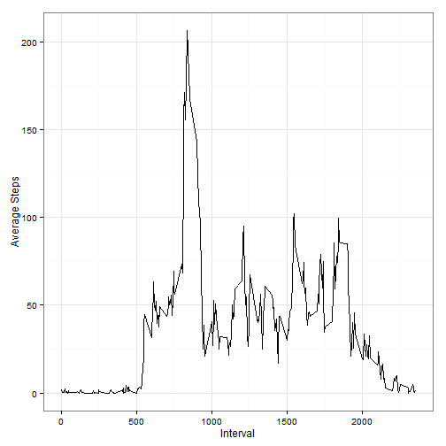

### Load required packages

```r
library(dplyr)
library(ggplot2)
```

## Loading and preprocessing the data

```r
if (!file.exists("activity.csv")){
    unzip(zipfile="activity.zip")
}
data <- read.csv("activity.csv") %>%
  mutate(date = as.Date(date, "%Y-%m-%d"))
str(data)
```

```
## 'data.frame':	17568 obs. of  3 variables:
##  $ steps   : int  NA NA NA NA NA NA NA NA NA NA ...
##  $ date    : Date, format: "2012-10-01" "2012-10-01" ...
##  $ interval: int  0 5 10 15 20 25 30 35 40 45 ...
```

## What is mean total number of steps taken per day?

```r
total_steps <- data %>%
  group_by(date) %>%
  summarize(steps = sum(steps, na.rm = TRUE))
qplot(steps, data=total_steps, binwidth=1000, xlab="steps each day")
```

 

```r
summarize(total_steps, mean(steps), median(steps))
```

```
## Source: local data frame [1 x 2]
## 
##   mean(steps) median(steps)
## 1     9354.23         10395
```

## What is the average daily activity pattern?

```r
avgDaily <- data %>%
  group_by(interval) %>%
  summarize(steps = mean(steps, na.rm = TRUE))

ggplot(avgDaily, aes(interval, steps)) +
  geom_line() + 
  theme_bw() +
  labs(x = "Interval",
       y = "Average Steps")
```

 

```r
avgDaily$interval[ which.max(avgDaily$steps) ]
```

```
## [1] 835
```

## Imputing missing values

```r
sum(is.na(data$steps))
```

```
## [1] 2304
```
Filling in all of the missing values in the dataset using average daily steps by interval.


```r
newData <- data %>%
  left_join(avgDaily, by = "interval") %>%
  mutate(steps = ifelse(is.na(steps.x), steps.y, steps.x))
```


```r
newAvgDaily <- newData %>%
  group_by(date) %>%
  summarize(steps = sum(steps))

qplot(steps, data=newAvgDaily, binwidth=1000, xlab="steps each day")
```

 

```r
summarize(newAvgDaily, mean(steps), median(steps))
```

```
## Source: local data frame [1 x 2]
## 
##   mean(steps) median(steps)
## 1    10766.19      10766.19
```

## Are there differences in activity patterns between weekdays and weekends?

```r
groupedData <- newData %>%
  mutate(weekday = as.POSIXlt(date)$wday) %>%
  mutate(weekday = weekday > 0 & weekday < 6) %>%
  mutate(weekday = factor(weekday, labels = c("Weekend", "Weekday"))) %>%
  group_by(weekday, interval) %>%
  summarize(steps = mean(steps))

ggplot(groupedData, aes(interval, steps)) +
  geom_line() +
  facet_grid(weekday ~ .) +
  theme_bw() +
  labs(x = "Interval",
       y = "Average Steps")
```

 
